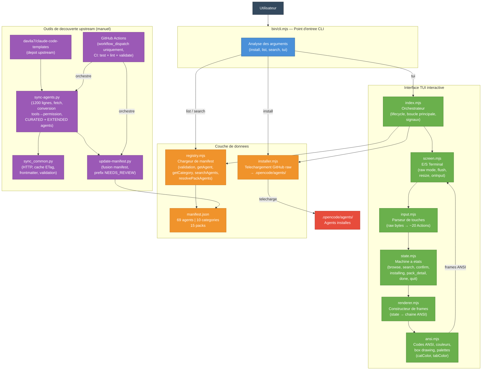
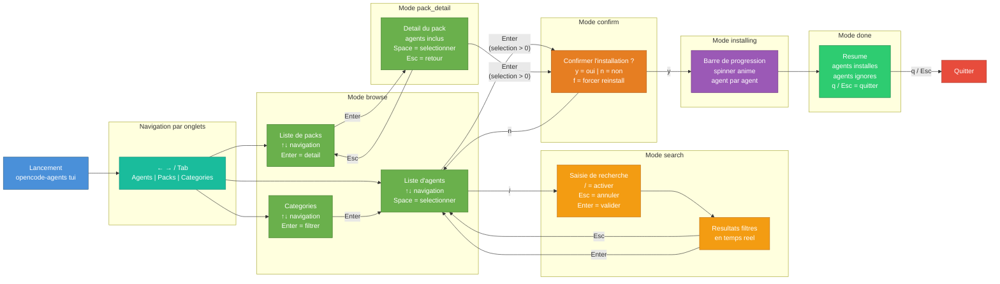

The OpenCode Agents system is built as a zero-dependency Node.js CLI with an interactive TUI, agent registry, installer, and upstream discovery tools. This page documents the architecture, data flow, and module structure.

## Overview

Three core subsystems:

1. **CLI + TUI** — User interface (argument parsing, interactive browser)
2. **Registry + Installer** — Agent catalog and file management
3. **Discovery Pipeline** — Upstream sync and quality validation (manual dispatch)



## Components

### 1. CLI (bin/cli.mjs)

**Responsibility:** Parse arguments, route commands.

**Supported commands:**
- `install [agent]` — Install one or more agents
- `uninstall [agent]` — Remove agents
- `list` — Show all agents by category
- `list --packs` — Show predefined packs
- `search <query>` — Fuzzy search agents
- `update` — Reinstall outdated agents (hash mismatch)
- `verify` — Check lock file integrity
- `rehash` — Rebuild lock from disk
- `tui` — Launch interactive browser

**Key features:**
- Zero dependencies (Node.js 20+ stdlib only)
- Multi-value flags: `--pack backend,devops` or `--pack backend --pack devops`
- Permission flags: `--permissions`, `--yolo`, `--permission-override`
- Dry-run mode: `--dry-run`
- Force overwrite: `--force`

**Entry point:** Node.js 20+ required, ESM-only.

### 2. TUI (src/tui/)

**Responsibility:** Interactive agent browser.

**Modules:**

| Module | Responsibility |
|--------|----------------|
| `index.mjs` | Lifecycle orchestrator, signal handling (SIGINT, SIGWINCH), main loop |
| `screen.mjs` | Terminal I/O (raw mode, ANSI flush, resize, input) |
| `input.mjs` | Key parser (raw bytes → ~20 Action types) |
| `state.mjs` | State machine (browse, search, confirm, installing, pack_detail, done, quit) |
| `renderer.mjs` | Frame builder (state → ANSI string) |
| `ansi.mjs` | ANSI codes, colors, box drawing, category/tab palettes |

**State flow:**



**Key features:**
- Auto-detect TTY (falls back to `--help` if stdin not a terminal)
- Smooth scrolling (viewport, cursor tracking)
- Real-time search filtering
- Graceful signal handling (SIGINT = quit, SIGWINCH = resize)
- Atomic state updates (no partial renders)

### 3. Registry (src/registry.mjs)

**Responsibility:** Load and validate `manifest.json`, expose query helpers.

**Manifest structure:**

```json
{
  "base_path": ".opencode/agents",
  "agents": [
    {
      "name": "typescript-pro",
      "category": "languages",
      "description": "Expert TypeScript developer",
      "mode": "code",
      "tags": ["typescript", "strict-mode", "type-system"]
    }
  ],
  "categories": {
    "languages": {
      "name": "Languages",
      "icon": "💻",
      "description": "Language-specific experts"
    }
  },
  "packs": {
    "backend": {
      "name": "Backend Stack",
      "description": "Full backend development",
      "agents": ["postgres-pro", "redis-specialist", "api-architect"]
    }
  }
}
```

**API:**

```javascript
import { 
  getManifest, 
  getAgent, 
  getCategory, 
  getCategoryIds,
  getPack,
  resolvePackAgents,
  searchAgents,
  listAll 
} from './registry.mjs';

// Get full manifest (cached)
const manifest = getManifest();

// Query single agent
const agent = getAgent('typescript-pro');

// Query by category
const languageAgents = getCategory('languages');

// Resolve pack to agent entries
const backendAgents = resolvePackAgents('backend');

// Fuzzy search
const results = searchAgents('docker');
// → [{ name: 'docker-specialist', score: 0.95 }, ...]
```

**Validation:**
- Agent names match `SAFE_NAME_RE` (alphanumeric, hyphens, underscores)
- Categories and packs reference only valid agents
- No duplicate agent names
- Required fields present (`name`, `category`, `description`, `mode`)

### 4. Installer (src/installer.mjs)

**Responsibility:** Download agents from GitHub raw and write to disk.

**Flow:**

1. Resolve agent URL: `https://raw.githubusercontent.com/<owner>/<repo>/<ref>/agents/<category>/<name>.md`
2. Download via HTTPS (Node.js `https` module)
3. Apply permission modifications if `--permissions` or `--permission-override` provided
4. Write to `.opencode/agents/<category>/<name>.md`
5. Record SHA-256 hash in lock file

**API:**

```javascript
import { installAgents } from './installer.mjs';

const result = await installAgents(agents, {
  force: false,
  dryRun: false,
  permissions: resolvedPermissions,
});

console.log(`${result.installed} installed, ${result.skipped} skipped, ${result.failed} failed`);
```

**Security:**
- Host allowlist (GitHub raw only)
- Path traversal prevention (no `..`, no absolute paths)
- HTTPS required
- SHA-256 integrity tracking (post-install)

### 5. Lock System (src/lock.mjs)

**Responsibility:** Track installed agent hashes, detect modifications.

See [Lock System](/advanced/lock-system) for full details.

**Key functions:**

```javascript
import { 
  readLock, 
  writeLock, 
  recordInstall, 
  removeLockEntry,
  detectAgentStates,
  findOutdatedAgents,
  verifyLockIntegrity,
  rehashLock,
  bootstrapLock 
} from './lock.mjs';
```

### 6. Permission System (src/permissions/)

**Responsibility:** Resolve and apply permission presets/overrides.

See [Permissions](/advanced/permissions) for full details.

**Modules:**

| Module | Responsibility |
|--------|----------------|
| `presets.mjs` | Define 4 presets (strict, balanced, permissive, yolo) |
| `resolve.mjs` | Layered precedence (CLI > saved > built-in) |
| `cli.mjs` | Parse permission flags (`--permissions`, `--yolo`, `--permission-override`) |
| `persistence.mjs` | Load/save preferences to `~/.config/opencode/agent-permissions.json` |
| `warnings.mjs` | Display security warnings for YOLO mode |
| `writer.mjs` | Modify agent frontmatter with resolved permissions |

### 7. Discovery Pipeline (scripts/)

**Responsibility:** Manual tools for upstream agent evaluation.

**Scripts:**

| Script | Purpose |
|--------|----------|
| `sync-agents.py` | Fetch agents from upstream, convert `tools:` → `permission:` |
| `sync_common.py` | HTTP utilities (ETag cache, frontmatter parser) |
| `update-manifest.py` | Merge sync manifest into root manifest |
| `quality_scorer.py` | 8-dimension quality scoring |
| `generate_readme_scores.py` | Regenerate README score tables |

**Workflow (manual dispatch only):**

1. Trigger via GitHub Actions `workflow_dispatch`
2. Parameters: `tier` (core/extended/all), `force`, `dry_run`
3. `sync-agents.py` fetches upstream agents
4. Convert `tools:` to `permission:` (CURATED_AGENTS dict for known agents)
5. `update-manifest.py` merges into root manifest
6. Prefix `[NEEDS_REVIEW]` for new agents
7. Validate (tests, frontmatter, manifest coherence)
8. If not dry_run: commit to `sync/agents-latest`, create PR

**Security:**
- Agents not in `CURATED_AGENTS` get `UNKNOWN_PERMISSIONS`
- Actions pinned by SHA (not mutable tags)
- Path traversal validation
- ETag-based HTTP caching

**Status:** Automatic sync (cron) disabled. Pipeline preserved as discovery tool.

## Data Flow

### Install Command

```
User → CLI → Registry → Installer → GitHub raw
                ↓           ↓
          getAgent()    download()
                ↓           ↓
          agent entry   agent content
                ↓           ↓
         Permissions → Lock System → Disk
                ↓           ↓
         applyPerms()  recordInstall()
                            ↓
                    .opencode/agents/
```

### TUI Session

```
User input → Input parser → Action
                ↓
            State reducer
                ↓
            New state
                ↓
            Renderer
                ↓
            ANSI frame
                ↓
            Screen flush
                ↓
            Terminal
```

### Verify Command

```
Disk agents → readFileSync() → SHA-256
                                  ↓
                            current hash
                                  ↓
Lock file → readLock() → lock hash
                              ↓
                          compare
                              ↓
                      {ok, mismatch, missing}
```

## File Structure

```
opencode-agents/
├── bin/
│   └── cli.mjs              # CLI entry point
├── src/
│   ├── meta.mjs             # Version constant
│   ├── registry.mjs         # Manifest loader
│   ├── installer.mjs        # Agent downloader
│   ├── lock.mjs             # Hash tracking
│   ├── display.mjs          # CLI output formatters
│   ├── permissions/
│   │   ├── presets.mjs      # Permission presets
│   │   ├── resolve.mjs      # Precedence resolver
│   │   ├── cli.mjs          # Flag parser
│   │   ├── persistence.mjs  # Save/load prefs
│   │   ├── warnings.mjs     # Security warnings
│   │   └── writer.mjs       # Frontmatter modifier
│   └── tui/
│       ├── index.mjs        # Orchestrator
│       ├── screen.mjs       # Terminal I/O
│       ├── input.mjs        # Key parser
│       ├── state.mjs        # State machine
│       ├── renderer.mjs     # Frame builder
│       └── ansi.mjs         # ANSI utilities
├── scripts/
│   ├── sync-agents.py       # Upstream fetcher
│   ├── sync_common.py       # HTTP utils
│   ├── update-manifest.py   # Manifest merger
│   ├── quality_scorer.py    # 8-dimension scorer
│   └── generate_readme_scores.py
├── agents/                  # Agent source files (not installed)
│   ├── languages/
│   ├── ai/
│   ├── web/
│   └── ...
├── manifest.json            # Agent registry
├── tests/                   # Node + Python tests
└── .opencode/agents/        # Installed agents (gitignored)
```

## Module Dependencies

**Zero npm dependencies.** All modules use Node.js 20+ stdlib:

- `fs` / `fs/promises` — File I/O
- `path` — Path manipulation
- `crypto` — SHA-256 hashing
- `https` — Agent downloads
- `readline` — TUI raw mode
- `process` — Signals, stdin/stdout

Python scripts require Python 3.10+ (stdlib only, no pip).

## Configuration

### Manifest Path

Default: `manifest.json` in repo root.

Override via `OPENCODE_AGENTS_MANIFEST` env var (for testing).

### Install Directory

Default: `.opencode/agents/` (from manifest `base_path`).

Can be overridden in manifest:

```json
{
  "base_path": "custom/agents",
  ...
}
```

### Permission Preferences

Stored in `~/.config/opencode/agent-permissions.json`:

```json
{
  "preset": "permissive",
  "overrides": [
    { "agent": null, "permission": "bash", "action": "allow" },
    { "agent": "postgres-pro", "permission": "webfetch", "action": "deny" }
  ]
}
```

## Testing

**893 tests** across Node.js and Python:

- **560 JS tests** (CLI, TUI, lock, registry, installer)
- **23 TypeScript tests** (plugin)
- **310 Python tests** (sync scripts, quality scorer)

```bash
# All Node tests
node --test tests/*.test.mjs

# All Python tests
python3 tests/run_tests.py

# CI validation
npm run validate  # frontmatter, manifest, no deprecated tools:
```

## CI/CD

Four parallel jobs on every push/PR:

1. **test** — Python tests (3.10, 3.12, 3.13)
2. **test-cli** — Node tests (20, 22, 23)
3. **lint** — Python/Node syntax, shellcheck, frontmatter, manifest
4. **validate-agents** — Manifest coherence, deprecated fields

Dependabot monitors GitHub Actions SHA pins, opens weekly PRs for updates.

## Performance

**CLI startup:** < 50ms (zero dependencies)

**TUI rendering:** 60+ FPS on modern terminals

**Install speed:** Network-bound (GitHub raw download)

**Manifest load:** < 5ms (cached after first read)

## Related

- [Permissions](/advanced/permissions) — Permission system deep dive
- [Lock System](/advanced/lock-system) — Integrity verification
- [Quality Scoring](/advanced/quality-scoring) — Agent quality metrics
