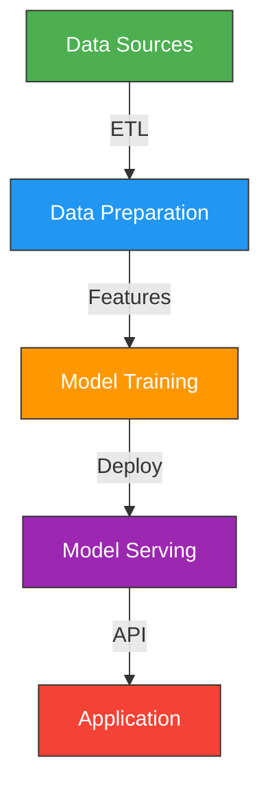

## Overview

The **AI & ML Suite** pack provides comprehensive coverage of artificial intelligence and machine learning workflows. From data science and model training to LLM architecture and prompt engineering — this pack equips you to build production AI systems.

Perfect for ML engineers, AI researchers, data scientists, and teams building LLM-powered applications.

## Installation

```bash
npx github:dmicheneau/opencode-template-agent install --pack ai
```

## Included Agents

<CardGroup cols={2}>
  <Card title="ai-engineer" icon="brain">
    **AI Systems Engineer**
    
    End-to-end AI systems from model selection to production deployment, MLOps, and monitoring
  </Card>
  
  <Card title="data-scientist" icon="chart-line">
    **Data Science Expert**
    
    Statistical analysis, predictive modeling, feature engineering, experimentation, and insights
  </Card>
  
  <Card title="ml-engineer" icon="robot">
    **ML Engineering**
    
    Production ML pipelines, model serving, automated retraining, monitoring, and performance tuning
  </Card>
  
  <Card title="llm-architect" icon="comments">
    **LLM System Design**
    
    LLM architecture, fine-tuning, RAG systems, inference optimization, and evaluation frameworks
  </Card>
  
  <Card title="prompt-engineer" icon="message">
    **Prompt Engineering**
    
    Prompt design, optimization, analysis, chain-of-thought reasoning, and structured outputs
  </Card>
  
  <Card title="search-specialist" icon="magnifying-glass">
    **Search & Research**
    
    Advanced search techniques, information retrieval, multi-source synthesis, and web research
  </Card>
</CardGroup>

## Who Should Use This Pack?

<AccordionGroup>
  <Accordion title="ML Engineers" icon="robot">
    Build production ML systems with automated pipelines, model serving, and monitoring
  </Accordion>
  
  <Accordion title="AI Researchers" icon="flask">
    Experiment with models, fine-tuning, and novel architectures
  </Accordion>
  
  <Accordion title="Data Scientists" icon="chart-line">
    Analyze data, build predictive models, and derive insights from complex datasets
  </Accordion>
  
  <Accordion title="LLM Application Developers" icon="comments">
    Build RAG systems, chatbots, and LLM-powered applications
  </Accordion>
</AccordionGroup>

## Example Workflow

Here's how to build an LLM-powered application using the AI pack:

<Steps>
  <Step title="Research and plan">
    Use **search-specialist** to gather information and **ai-engineer** for architecture
    
    ```bash
    @ai/search-specialist
    Research the latest RAG techniques and vector database options
    
    @ai/ai-engineer
    Design an architecture for a customer support chatbot with RAG
    ```
  </Step>
  
  <Step title="Prepare and analyze data">
    Use **data-scientist** for exploratory data analysis
    
    ```bash
    @ai/data-scientist
    Analyze this customer support ticket dataset for patterns and insights
    ```
  </Step>
  
  <Step title="Design the LLM system">
    Use **llm-architect** for RAG architecture and model selection
    
    ```bash
    @ai/llm-architect
    Design a RAG system with embeddings, vector search, and context retrieval
    ```
  </Step>
  
  <Step title="Optimize prompts">
    Use **prompt-engineer** to create effective prompts
    
    ```bash
    @ai/prompt-engineer
    Optimize this prompt for customer support responses with structured JSON output
    ```
  </Step>
  
  <Step title="Build production pipeline">
    Use **ml-engineer** for serving infrastructure
    
    ```bash
    @ai/ml-engineer
    Create a production pipeline for embedding generation and model serving
    ```
  </Step>
  
  <Step title="Deploy and monitor">
    Use **ai-engineer** for deployment and monitoring
    
    ```bash
    @ai/ai-engineer
    Set up monitoring for latency, token usage, and response quality
    ```
  </Step>
</Steps>

## Key Capabilities

### LLM Systems
- RAG (Retrieval-Augmented Generation) architecture
- Fine-tuning and model adaptation
- Prompt engineering and optimization
- Context window management
- Inference optimization and caching

### Machine Learning
- Model training and hyperparameter tuning
- Feature engineering and selection
- Model evaluation and validation
- Automated retraining pipelines
- A/B testing frameworks

### Data Science
- Exploratory data analysis
- Statistical modeling
- Predictive analytics
- Time series forecasting
- Causal inference

### Production ML
- Model serving infrastructure
- Batch and real-time inference
- Model monitoring and drift detection
- MLOps automation
- Performance optimization

## Common Use Cases

<Tabs>
  <Tab title="RAG Application">
    **Agents:** llm-architect → prompt-engineer → ml-engineer → ai-engineer
    
    Build retrieval-augmented generation systems for Q&A, chatbots, or documentation search.
  </Tab>
  
  <Tab title="Predictive Model">
    **Agents:** data-scientist → ml-engineer → ai-engineer
    
    Develop and deploy predictive models for forecasting, classification, or recommendation.
  </Tab>
  
  <Tab title="LLM Fine-Tuning">
    **Agents:** llm-architect → data-scientist → ml-engineer
    
    Fine-tune foundation models for domain-specific tasks.
  </Tab>
  
  <Tab title="Research Project">
    **Agents:** search-specialist → data-scientist → ai-engineer
    
    Conduct research, analyze data, and experiment with novel approaches.
  </Tab>
</Tabs>

## Tech Stack Coverage



| Area | Technologies | Agents |
|------|--------------|--------|
| **LLM** | OpenAI, Anthropic, Llama, RAG, vector DBs | llm-architect, prompt-engineer |
| **ML** | PyTorch, TensorFlow, scikit-learn, XGBoost | ml-engineer, data-scientist |
| **Data** | Pandas, NumPy, SQL, Spark | data-scientist, search-specialist |
| **MLOps** | MLflow, Weights & Biases, Kubeflow | ml-engineer, ai-engineer |
| **Serving** | FastAPI, Ray Serve, TorchServe, Triton | ml-engineer, ai-engineer |
| **Monitoring** | Prometheus, Grafana, custom metrics | ai-engineer, ml-engineer |

## LLM Application Patterns

<AccordionGroup>
  <Accordion title="RAG (Retrieval-Augmented Generation)" icon="book">
    Use **llm-architect** and **prompt-engineer** to build systems that retrieve relevant context before generating responses
  </Accordion>
  
  <Accordion title="Agentic Workflows" icon="robot">
    Use **llm-architect** and **ai-engineer** to create autonomous agents that use tools and make decisions
  </Accordion>
  
  <Accordion title="Fine-Tuning" icon="sliders">
    Use **llm-architect** and **ml-engineer** to adapt foundation models to specific domains or tasks
  </Accordion>
  
  <Accordion title="Structured Outputs" icon="table">
    Use **prompt-engineer** to generate JSON, SQL, or other structured formats reliably
  </Accordion>
</AccordionGroup>

## ML Model Types

| Model Type | Use Cases | Key Agents |
|------------|-----------|------------|
| **Classification** | Spam detection, sentiment analysis, fraud detection | data-scientist, ml-engineer |
| **Regression** | Price prediction, forecasting, demand estimation | data-scientist, ml-engineer |
| **Clustering** | Customer segmentation, anomaly detection | data-scientist |
| **Recommender** | Product recommendations, content personalization | data-scientist, ml-engineer |
| **NLP** | Text classification, NER, summarization | llm-architect, prompt-engineer |
| **Computer Vision** | Image classification, object detection, segmentation | ai-engineer, ml-engineer |

## Complementary Agents

Consider adding these agents for expanded capabilities:

- **data-engineer** — Build ETL pipelines and data infrastructure
- **mlops-engineer** — Deep MLOps expertise for production systems
- **python-pro** — Advanced Python for ML development
- **api-architect** — Design APIs for model serving
- **performance-engineer** — Optimize inference latency

## Next Steps

<CardGroup cols={2}>
  <Card title="Install AI Pack" icon="download">
    ```bash
    npx github:dmicheneau/opencode-template-agent install --pack ai
    ```
  </Card>
  
  <Card title="Explore Individual Agents" icon="users" href="/agents/overview">
    Browse detailed documentation for each agent
  </Card>
  
  <Card title="Data Stack Pack" icon="database" href="/packs/overview">
    Add data engineering for ETL and warehousing
  </Card>
  
  <Card title="ML to Production Pack" icon="rocket" href="/packs/overview">
    Alternative pack with MLOps and deployment focus
  </Card>
</CardGroup>
