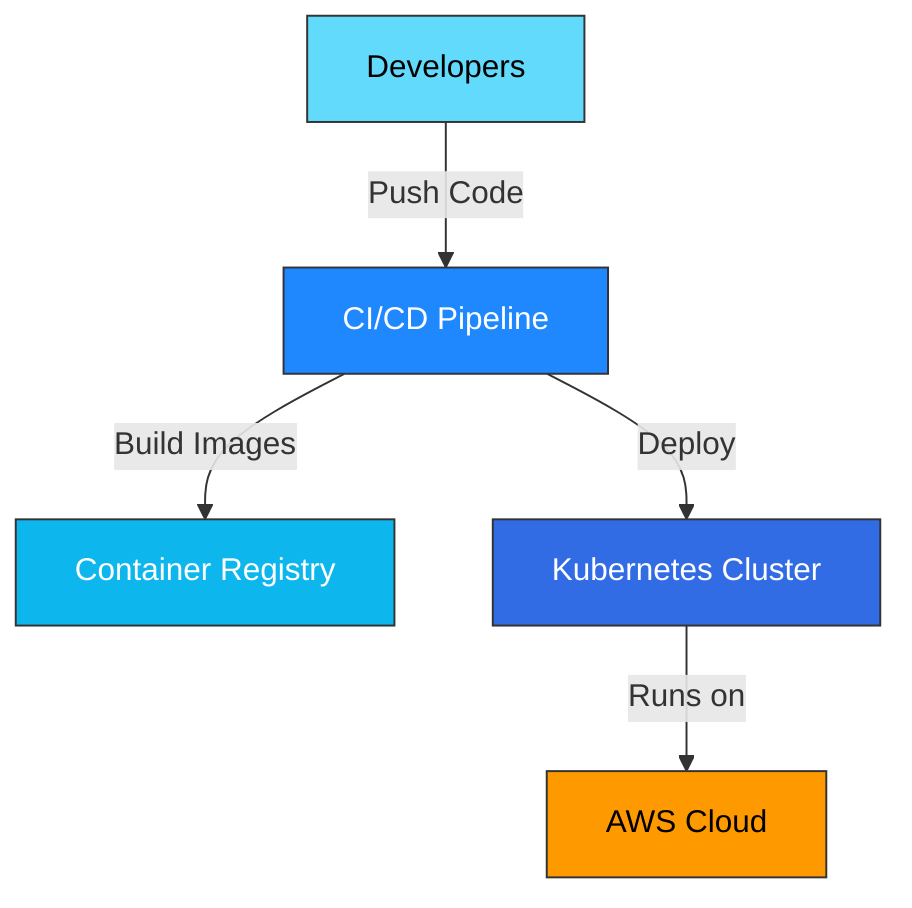

## Overview

The **DevOps Toolkit** pack provides comprehensive infrastructure and deployment automation capabilities. From containerization to orchestration, from infrastructure-as-code to incident response — this pack covers the complete DevOps lifecycle.

Perfect for platform engineers, SREs, DevOps specialists, and teams managing cloud infrastructure.

## Installation

```bash
npx github:dmicheneau/opencode-template-agent install --pack devops
```

## Included Agents

<CardGroup cols={2}>
  <Card title="docker-specialist" icon="docker">
    **Docker Expert**
    
    Multi-stage builds, image optimization, security best practices, and Docker Compose orchestration
  </Card>
  
  <Card title="kubernetes-specialist" icon="dharmachakra">
    **Kubernetes Expert**
    
    Cluster design, deployments, services, ingress, StatefulSets, operators, and production troubleshooting
  </Card>
  
  <Card title="terraform-specialist" icon="cube">
    **Terraform Expert**
    
    Infrastructure-as-Code, modules, state management, providers, and multi-cloud deployments
  </Card>
  
  <Card title="aws-specialist" icon="aws">
    **AWS Expert**
    
    Architecture design, cost optimization, Well-Architected Framework, security, and service selection
  </Card>
  
  <Card title="ci-cd-engineer" icon="gears">
    **CI/CD Expert**
    
    GitHub Actions, GitLab CI, Jenkins, deployment automation, testing pipelines, and release strategies
  </Card>
  
  <Card title="linux-admin" icon="linux">
    **Linux Administration**
    
    Server administration, systemd, networking, security hardening, shell scripting, and troubleshooting
  </Card>
  
  <Card title="platform-engineer" icon="sitemap">
    **Platform Engineering**
    
    Internal Developer Platforms, golden paths, GitOps, self-service, and developer experience
  </Card>
  
  <Card title="incident-responder" icon="fire-extinguisher">
    **Incident Response**
    
    Production triage, mitigation strategies, communication protocols, and postmortem analysis
  </Card>
</CardGroup>

## Who Should Use This Pack?

<AccordionGroup>
  <Accordion title="DevOps Engineers" icon="gears">
    Build and maintain CI/CD pipelines, container orchestration, and infrastructure automation
  </Accordion>
  
  <Accordion title="Platform Engineers" icon="sitemap">
    Create Internal Developer Platforms with self-service infrastructure and golden paths
  </Accordion>
  
  <Accordion title="SREs" icon="gauge-high">
    Manage production systems, respond to incidents, and maintain reliability
  </Accordion>
  
  <Accordion title="Cloud Architects" icon="cloud">
    Design scalable, cost-effective cloud infrastructure on AWS
  </Accordion>
</AccordionGroup>

## Example Workflow

Here's how to deploy a complete application using the DevOps pack:

<Steps>
  <Step title="Containerize the application">
    Use **docker-specialist** to create optimized Docker images
    
    ```bash
    @devops/docker-specialist
    Create a multi-stage Dockerfile for a Node.js app with minimal image size
    ```
  </Step>
  
  <Step title="Set up infrastructure-as-code">
    Use **terraform-specialist** to define cloud resources
    
    ```bash
    @devops/terraform-specialist
    Create Terraform modules for VPC, EKS cluster, and RDS database
    ```
  </Step>
  
  <Step title="Configure AWS resources">
    Use **aws-specialist** for architecture and cost optimization
    
    ```bash
    @devops/aws-specialist
    Design a highly available architecture with auto-scaling and cost optimization
    ```
  </Step>
  
  <Step title="Deploy to Kubernetes">
    Use **kubernetes-specialist** for orchestration
    
    ```bash
    @devops/kubernetes-specialist
    Create Kubernetes manifests with deployments, services, and ingress
    ```
  </Step>
  
  <Step title="Build CI/CD pipeline">
    Use **ci-cd-engineer** to automate deployments
    
    ```bash
    @devops/ci-cd-engineer
    Create a GitHub Actions workflow for testing, building, and deploying to EKS
    ```
  </Step>
  
  <Step title="Configure servers">
    Use **linux-admin** for server setup and hardening
    
    ```bash
    @devops/linux-admin
    Set up bastion host with security hardening and audit logging
    ```
  </Step>
  
  <Step title="Enable self-service">
    Use **platform-engineer** to create developer-friendly workflows
    
    ```bash
    @devops/platform-engineer
    Design an IDP for developers to deploy services without ops involvement
    ```
  </Step>
  
  <Step title="Prepare for incidents">
    Use **incident-responder** to create runbooks
    
    ```bash
    @devops/incident-responder
    Create incident response runbooks for common production issues
    ```
  </Step>
</Steps>

## Key Capabilities

### Containerization & Orchestration
- Multi-stage Docker builds
- Image optimization and security scanning
- Kubernetes cluster management
- Helm charts and operators
- Service mesh (Istio, Linkerd)

### Infrastructure-as-Code
- Terraform modules and state management
- Multi-cloud and multi-region deployments
- Resource dependency management
- Secret management integration
- Infrastructure testing

### Cloud Platforms
- AWS architecture and service selection
- Cost optimization strategies
- Well-Architected Framework compliance
- Security and IAM policies
- Disaster recovery planning

### CI/CD & Automation
- GitHub Actions workflows
- GitLab CI pipelines
- Jenkins pipeline-as-code
- Automated testing and quality gates
- Blue/green and canary deployments

### Platform & Operations
- Internal Developer Platforms
- GitOps with ArgoCD/Flux
- Observability and monitoring
- Incident management
- Production troubleshooting

## Common Use Cases

<Tabs>
  <Tab title="Kubernetes Deployment">
    **Agents:** docker-specialist → kubernetes-specialist → ci-cd-engineer
    
    Containerize apps, deploy to Kubernetes, and automate with CI/CD.
  </Tab>
  
  <Tab title="AWS Infrastructure">
    **Agents:** aws-specialist → terraform-specialist → platform-engineer
    
    Design and provision AWS infrastructure with IaC and developer self-service.
  </Tab>
  
  <Tab title="CI/CD Pipeline">
    **Agents:** ci-cd-engineer → docker-specialist → kubernetes-specialist
    
    Build complete deployment automation from code commit to production.
  </Tab>
  
  <Tab title="Incident Response">
    **Agents:** incident-responder → kubernetes-specialist → linux-admin
    
    Respond to production outages and troubleshoot infrastructure issues.
  </Tab>
</Tabs>

## Tech Stack Coverage



| Technology | Agents | Capabilities |
|------------|--------|-------------|
| **Docker** | docker-specialist | Multi-stage builds, optimization, security |
| **Kubernetes** | kubernetes-specialist | Deployments, services, ingress, StatefulSets |
| **Terraform** | terraform-specialist | IaC, modules, state management |
| **AWS** | aws-specialist | Architecture, cost optimization, security |
| **CI/CD** | ci-cd-engineer | GitHub Actions, GitLab CI, Jenkins |
| **Linux** | linux-admin | Server admin, systemd, networking |
| **Platform** | platform-engineer | IDP, GitOps, self-service |
| **Incidents** | incident-responder | Triage, mitigation, postmortems |

## Deployment Strategies

<AccordionGroup>
  <Accordion title="Blue/Green Deployment" icon="toggle-on">
    Use **kubernetes-specialist** and **ci-cd-engineer** to implement zero-downtime deployments with instant rollback capability
  </Accordion>
  
  <Accordion title="Canary Releases" icon="bird">
    Use **kubernetes-specialist** to gradually roll out changes to a subset of users before full deployment
  </Accordion>
  
  <Accordion title="GitOps Workflow" icon="code-branch">
    Use **platform-engineer** to implement GitOps with ArgoCD or Flux for declarative infrastructure
  </Accordion>
  
  <Accordion title="Multi-Region DR" icon="globe">
    Use **terraform-specialist** and **aws-specialist** to design disaster recovery across multiple regions
  </Accordion>
</AccordionGroup>

## Complementary Agents

Consider adding these agents for expanded capabilities:

- **sre-engineer** — Add SLO/SLI tracking and error budgets
- **security-engineer** — Deep security auditing and threat modeling
- **database-architect** — Design scalable database infrastructure
- **performance-engineer** — Optimize application and infrastructure performance
- **monitoring-specialist** — Deep observability with Prometheus, Grafana, and ELK

## Next Steps

<CardGroup cols={2}>
  <Card title="Install DevOps Pack" icon="download">
    ```bash
    npx github:dmicheneau/opencode-template-agent install --pack devops
    ```
  </Card>
  
  <Card title="Explore Individual Agents" icon="users" href="/agents/overview">
    Browse detailed documentation for each agent
  </Card>
  
  <Card title="Backend Pack" icon="server" href="/packs/backend">
    Build applications to deploy with this infrastructure
  </Card>
  
  <Card title="Security Pack" icon="shield-halved" href="/packs/security">
    Add comprehensive security auditing
  </Card>
</CardGroup>
