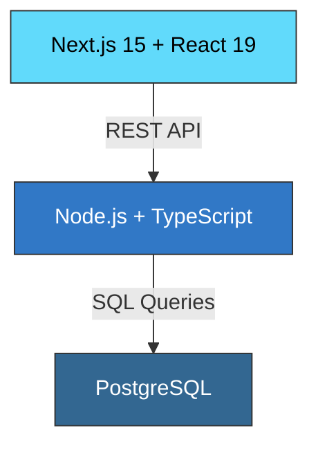

## Overview

The **Full-Stack Developer** pack provides comprehensive coverage of the entire application stack. From PostgreSQL databases to React frontends, from API design to code review — this pack equips you to build complete applications independently.

Perfect for full-stack engineers, solo developers, and small teams wearing multiple hats.

## Installation

```bash
npx github:dmicheneau/opencode-template-agent install --pack fullstack
```

## Included Agents

<CardGroup cols={2}>
  <Card title="fullstack-developer" icon="layer-group">
    **Full-Stack Generalist**
    
    End-to-end development across database, API, and frontend layers with architectural guidance
  </Card>
  
  <Card title="typescript-pro" icon="code">
    **TypeScript Expert**
    
    Full-stack type safety, generics, utility types, Node.js backend, and React frontend
  </Card>
  
  <Card title="react-specialist" icon="react">
    **React 19+ Expert**
    
    Modern hooks, Server Components, Actions, state management, and performance patterns
  </Card>
  
  <Card title="nextjs-developer" icon="n">
    **Next.js 15+ Developer**
    
    App Router, Server Components, API routes, authentication, and deployment
  </Card>
  
  <Card title="postgres-pro" icon="database">
    **PostgreSQL Expert**
    
    Schema design, query optimization, migrations, replication, and production tuning
  </Card>
  
  <Card title="api-architect" icon="plug">
    **API Design Expert**
    
    REST architecture, versioning, error handling, rate limiting, and OpenAPI documentation
  </Card>
  
  <Card title="debugger" icon="bug">
    **Debugging Specialist**
    
    Full-stack debugging from database queries to frontend rendering issues
  </Card>
  
  <Card title="test-automator" icon="flask">
    **Testing Expert**
    
    Unit, integration, and E2E tests across the stack with CI/CD integration
  </Card>
  
  <Card title="code-reviewer" icon="eye">
    **Code Review Specialist**
    
    Quality reviews, security vulnerability detection, best practices, and architectural feedback
  </Card>
</CardGroup>

## Who Should Use This Pack?

<AccordionGroup>
  <Accordion title="Full-Stack Engineers" icon="layer-group">
    Build complete applications from database design to user interface
  </Accordion>
  
  <Accordion title="Solo Developers" icon="user">
    Cover all aspects of application development without relying on specialists
  </Accordion>
  
  <Accordion title="Startup Teams" icon="rocket">
    Small teams that need to move fast across the entire stack
  </Accordion>
  
  <Accordion title="Tech Leads" icon="star">
    Maintain expertise across all layers while guiding team decisions
  </Accordion>
</AccordionGroup>

## Example Workflow

Here's how to build a complete feature using the Full-Stack pack:

<Steps>
  <Step title="Plan the feature">
    Use **fullstack-developer** for architectural guidance
    
    ```bash
    @autres/fullstack-developer
    I need to build a collaborative document editor. What's the best architecture?
    ```
  </Step>
  
  <Step title="Design the database schema">
    Use **postgres-pro** to create an efficient data model
    
    ```bash
    @data-api/postgres-pro
    Design a schema for documents, users, permissions, and real-time collaboration
    ```
  </Step>
  
  <Step title="Build the API layer">
    Use **api-architect** and **typescript-pro** to implement REST endpoints
    
    ```bash
    @data-api/api-architect
    Design REST endpoints for document CRUD and collaboration features
    
    @languages/typescript-pro
    Implement these endpoints in Node.js with proper types
    ```
  </Step>
  
  <Step title="Create the frontend">
    Use **nextjs-developer** and **react-specialist** for the UI
    
    ```bash
    @web/nextjs-developer
    Set up Next.js 15 App Router with authentication
    
    @web/react-specialist
    Build the document editor component with real-time collaboration
    ```
  </Step>
  
  <Step title="Add tests">
    Use **test-automator** for comprehensive test coverage
    
    ```bash
    @devtools/test-automator
    Create unit tests for API endpoints and E2E tests for the editor
    ```
  </Step>
  
  <Step title="Review and refine">
    Use **code-reviewer** for quality checks and **debugger** for issues
    
    ```bash
    @devtools/code-reviewer
    Review this implementation for security issues and best practices
    
    @devtools/debugger
    The real-time updates are delayed. Help me debug the WebSocket connection
    ```
  </Step>
</Steps>

## Key Capabilities

### Database Layer
- PostgreSQL schema design and normalization
- Query optimization and indexing
- Migration management
- Transaction handling
- Connection pooling

### Backend/API Layer
- RESTful API design
- TypeScript Node.js services
- Authentication and authorization
- Error handling and validation
- WebSocket and real-time features

### Frontend Layer
- Next.js with App Router
- React Server and Client Components
- Type-safe data fetching
- State management
- Responsive UI design

### Quality & Debugging
- Full-stack testing strategy
- Code quality reviews
- Security auditing
- Performance profiling
- Production debugging

## Common Use Cases

<Tabs>
  <Tab title="SaaS Application">
    **Flow:** postgres-pro → api-architect → typescript-pro → nextjs-developer → test-automator
    
    Build multi-tenant SaaS apps with authentication, billing, and admin dashboards.
  </Tab>
  
  <Tab title="E-Commerce Platform">
    **Flow:** postgres-pro → api-architect → nextjs-developer → react-specialist → code-reviewer
    
    Create shopping experiences with product catalog, cart, checkout, and order management.
  </Tab>
  
  <Tab title="Internal Tool">
    **Flow:** fullstack-developer → postgres-pro → nextjs-developer → test-automator
    
    Rapid development of internal tools and admin interfaces.
  </Tab>
  
  <Tab title="API + Dashboard">
    **Flow:** api-architect → typescript-pro → postgres-pro → react-specialist → debugger
    
    Build REST APIs with interactive dashboards for data visualization.
  </Tab>
</Tabs>

## Tech Stack

This pack is optimized for the modern TypeScript full-stack:



| Layer | Technologies | Agents |
|-------|--------------|--------|
| **Frontend** | React 19, Next.js 15, TypeScript | react-specialist, nextjs-developer, typescript-pro |
| **Backend** | Node.js, Express/Fastify, TypeScript | typescript-pro, api-architect, fullstack-developer |
| **Database** | PostgreSQL, Prisma/TypeORM | postgres-pro, api-architect |
| **Testing** | Jest, React Testing Library, Playwright | test-automator |
| **Quality** | ESLint, Prettier, code review | code-reviewer |

## Complementary Agents

Expand your capabilities with these additions:

- **redis-specialist** — Add caching and session management
- **docker-specialist** — Containerize your application
- **ci-cd-engineer** — Automate deployment pipelines
- **ui-designer** — Enhance design system consistency
- **performance-engineer** — Optimize Core Web Vitals

## Comparison with Specialized Packs

| Need | Full-Stack Pack | Alternative |
|------|----------------|-------------|
| **Deep backend expertise** | ✓ Good coverage | backend pack has 2 additional DB agents |
| **Advanced frontend features** | ✓ Good coverage | frontend pack adds ui-designer and performance-engineer |
| **Infrastructure/deployment** | ✗ Not included | Add devops pack for Docker, Kubernetes, CI/CD |
| **Security auditing** | ✓ Code review only | Add security pack for comprehensive audits |
| **Solo development** | ✓✓ Ideal choice | Best all-in-one option |

## Next Steps

<CardGroup cols={2}>
  <Card title="Install Full-Stack Pack" icon="download">
    ```bash
    npx github:dmicheneau/opencode-template-agent install --pack fullstack
    ```
  </Card>
  
  <Card title="Explore Individual Agents" icon="users" href="/agents/overview">
    Browse detailed documentation for each agent
  </Card>
  
  <Card title="DevOps Pack" icon="gears" href="/packs/devops">
    Add deployment and infrastructure automation
  </Card>
  
  <Card title="Startup Kit" icon="rocket" href="/packs/overview">
    Alternative pack with product and design agents
  </Card>
</CardGroup>
